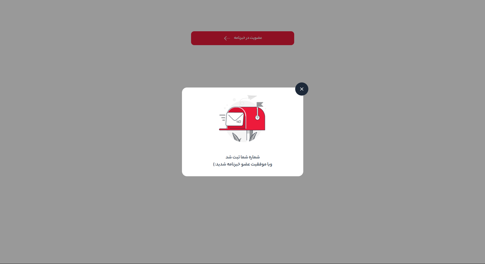

# 📬 Newsletter Subscription Popup

Hi! This project is a simple and elegant popup component that confirms a successful newsletter subscription. It's built using **HTML**, **CSS**, and **JavaScript**, and features a fully responsive design with Persian typography and SVG icons.

&nbsp;

## 📸 Preview




&nbsp;

## ✨ Features

- Beautiful and modern popup design  
- Smooth popup open/close animation  
- Close button for dismissing the popup  
- Fully responsive on mobile and desktop  
- Uses CSS variables and Persian font  

&nbsp;

## 🛠️ Technologies Used

- HTML5  
- CSS3 (with custom properties/variables)  
- Vanilla JavaScript  
- Persian font: YekanBakh  
- Scalable Vector Graphics (SVG icons)  

&nbsp;

## 🧩 Project Structure

```bash

📁 project-root/
│
├── index.html             
├── styles/
│   └── app.css           
├── scripts/
│   └── script.js        
├── images/
│   └── vector.png       

```
&nbsp;

## How to Use
1.Clone or download the project:

```bash

git clone https://github.com/Shahzadhpr/Popup.git

```
2.Open index.html in your browser.

3.Click the "Subscribe to Newsletter" button to display the popup.

&nbsp;

## 🤝 Contact Me  
If you have questions, suggestions, or would like to collaborate, feel free to reach out:

<div align="left">
  <a href="https://www.linkedin.com/in/hassanpourshahzad" target="_blank" style="margin-left: 10px;">
    
  </a> 
  <a href="https://t.me/Shahzad_hpr" target="_blank">
    
  </a>
</div>

&nbsp;

##  🙏 Thanks
Thank you for visiting this project. If you found it helpful, please consider giving it a ⭐️ or sharing your feedback. 💖